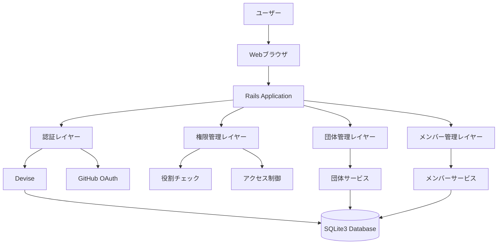
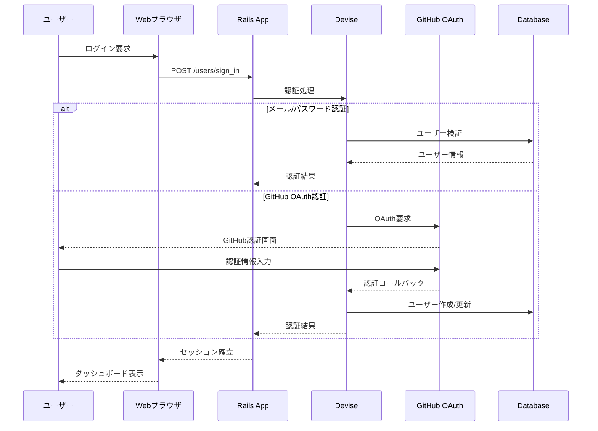
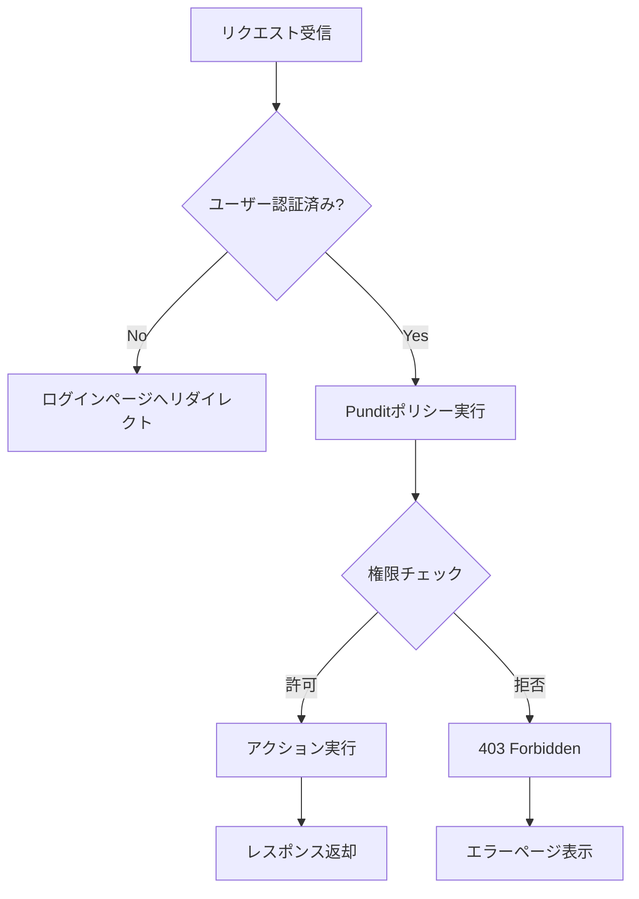
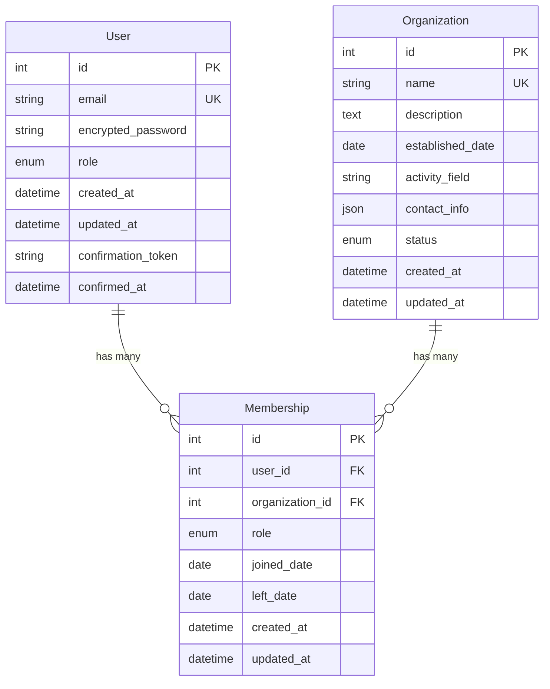
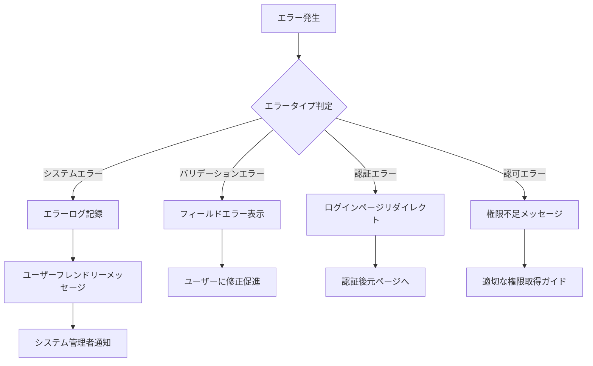

# 技術設計文書

## 概要
課外活動団体管理システムは、既存のRails 8.0アプリケーションを拡張し、大学や学校における課外活動団体の包括的な管理機能を提供します。職員、団体長、メンバー、一般ユーザーの4段階権限体系により、適切なアクセス制御を実現し、団体とメンバーの効率的な管理を可能にします。

**目的**: このシステムは教育機関の課外活動運営の透明性と効率性を向上させ、管理者と参加者双方にとって使いやすい管理環境を提供します。
**ユーザー**: 職員（全体管理）、団体長（所属団体管理）、メンバー（情報閲覧・編集）、一般ユーザー（公開情報閲覧）が、それぞれの権限に応じた機能を利用します。
**影響**: 現在の基本的なユーザー認証システムを拡張し、団体管理とメンバー管理の新機能を追加することで、包括的な課外活動管理プラットフォームに発展させます。

### 目標
- 既存のDevise認証システムを活用した4段階権限管理の実装
- 団体情報の作成、更新、削除、検索機能の提供
- メンバー管理機能による参加状況と役職の効率的な管理
- データ整合性とセキュリティの確保

### 対象外
- 外部システムとの連携（学務システム、財務システム等）
- リアルタイム通知機能（将来の拡張として検討）
- モバイルアプリケーション（Webベースのレスポンシブ対応のみ）

## アーキテクチャ

### 既存アーキテクチャ分析
現在のシステムは以下の特徴を持ちます：
- Rails 8.0 + Hotwire（Turbo/Stimulus）によるモダンなフロントエンド
- Devise + OmniAuth（GitHub）による認証システム
- SQLite3データベース（開発環境）
- Tailwind CSSによるスタイリング
- MVC パターンに従った標準的なRails構造

### 高レベルアーキテクチャ



**アーキテクチャ統合**:
- 既存パターンの保持: Rails MVC、Devise認証、Hotwire SPA体験
- 新コンポーネントの根拠: 団体管理とメンバー管理は独立したドメインとして分離
- 技術スタック整合性: 既存のRails 8.0 + Hotwire + Tailwind CSS構成を維持
- ステアリング準拠: RESTful設計原則とRailsの慣例に従った実装

### 技術スタック整合性

**既存技術スタックとの整合**:
- **フレームワーク**: Rails 8.0の機能（Solid Cache/Queue/Cable）を活用
- **認証**: 既存のDevise設定とGitHub OAuthを拡張
- **フロントエンド**: Hotwire（Turbo + Stimulus）による既存のSPA体験を維持
- **スタイリング**: Tailwind CSSによる一貫したデザインシステム
- **データベース**: SQLite3（開発）から本番環境での適切なRDBMSへの移行準備

**新規依存関係**:
- Pundit gem: 権限管理の標準化
- Ransack gem: 高度な検索機能
- Kaminari gem: ページネーション

**主要設計決定**:

**決定**: Punditを使用した権限管理システムの実装
**コンテキスト**: 4段階の複雑な権限体系を効率的に管理する必要性
**代替案**: CanCanCan、独自実装、Role-based access control
**選択アプローチ**: Punditによるポリシーベースの権限管理
**根拠**: Railsコミュニティでの標準的な選択肢で、テスタビリティと保守性が高い
**トレードオフ**: 学習コストはあるが、長期的な保守性と拡張性を優先

**決定**: 団体とメンバーの関連を中間テーブル（Membership）で管理
**コンテキスト**: ユーザーが複数団体に所属し、団体ごとに異なる役職を持つ可能性
**代替案**: 直接関連、JSON配列での管理、単一所属制限
**選択アプローチ**: Membershipモデルによる多対多関係の正規化
**根拠**: データ整合性の確保と将来の拡張性（役職履歴、参加期間等）
**トレードオフ**: クエリの複雑さは増すが、データモデルの柔軟性を確保

## システムフロー

### ユーザー認証フロー



### 権限チェックフロー



## 要件トレーサビリティ

| 要件 | 要件概要 | コンポーネント | インターフェース | フロー |
|------|----------|----------------|------------------|--------|
| 1.1-1.5 | ユーザー認証システム | Devise, OmniAuth | SessionsController, RegistrationsController | 認証フロー |
| 2.1-2.6 | 権限管理システム | Pundit, ApplicationPolicy | PolicyクラスとAuthorization | 権限チェックフロー |
| 3.1-3.6 | 課外活動団体管理 | OrganizationService, OrganizationsController | REST API | 団体管理フロー |
| 4.1-4.6 | メンバー管理システム | MembershipService, MembershipsController | REST API | メンバー管理フロー |
| 5.1-5.5 | データ整合性とセキュリティ | ValidationService, AuditLog | バリデーション、ログ記録 | セキュリティフロー |

## コンポーネントとインターフェース

### 認証・認可レイヤー

#### AuthenticationService

**責任と境界**
- **主要責任**: ユーザー認証とセッション管理
- **ドメイン境界**: ユーザー認証ドメイン
- **データ所有権**: ユーザーセッション情報
- **トランザクション境界**: 認証処理の原子性

**依存関係**
- **インバウンド**: ApplicationController、各種Controller
- **アウトバウンド**: Devise、OmniAuth、User モデル
- **外部**: GitHub OAuth API

**契約定義**

**サービスインターフェース**:
```typescript
interface AuthenticationService {
  authenticateUser(credentials: LoginCredentials): Result<User, AuthError>;
  authenticateWithOAuth(provider: string, authData: OAuthData): Result<User, AuthError>;
  signOutUser(user: User): Result<void, AuthError>;
  resetPassword(email: string): Result<void, AuthError>;
}

type LoginCredentials = {
  email: string;
  password: string;
};

type AuthError = 'INVALID_CREDENTIALS' | 'ACCOUNT_LOCKED' | 'EMAIL_NOT_CONFIRMED';
```

#### AuthorizationService (Pundit)

**責任と境界**
- **主要責任**: 権限チェックとアクセス制御
- **ドメイン境界**: 認可ドメイン
- **データ所有権**: 権限ポリシー定義
- **トランザクション境界**: 権限チェックは読み取り専用

**依存関係**
- **インバウンド**: 全てのController
- **アウトバウンド**: User、Organization、Membership モデル
- **外部**: なし

**契約定義**

**サービスインターフェース**:
```typescript
interface AuthorizationService {
  authorize(user: User, action: string, resource: any): Result<boolean, AuthError>;
  authorizedScope(user: User, resourceClass: any): Result<QueryScope, AuthError>;
}

type QueryScope = {
  where: Record<string, any>;
  includes: string[];
};
```

### 団体管理レイヤー

#### OrganizationService

**責任と境界**
- **主要責任**: 課外活動団体の CRUD 操作と検索
- **ドメイン境界**: 団体管理ドメイン
- **データ所有権**: 団体情報、団体メタデータ
- **トランザクション境界**: 団体操作の原子性

**依存関係**
- **インバウンド**: OrganizationsController
- **アウトバウンド**: Organization、Membership モデル
- **外部**: なし

**契約定義**

**サービスインターフェース**:
```typescript
interface OrganizationService {
  createOrganization(data: OrganizationData): Result<Organization, ValidationError>;
  updateOrganization(id: number, data: Partial<OrganizationData>): Result<Organization, ValidationError>;
  deleteOrganization(id: number): Result<void, ValidationError>;
  searchOrganizations(criteria: SearchCriteria): Result<Organization[], ValidationError>;
  getOrganizationDetails(id: number): Result<OrganizationWithMembers, NotFoundError>;
}

type OrganizationData = {
  name: string;
  description: string;
  establishedDate: Date;
  activityField: string;
  contactInfo: ContactInfo;
};

type SearchCriteria = {
  name?: string;
  activityField?: string;
  establishedYear?: number;
};
```

**APIコントラクト**:
| Method | Endpoint | Request | Response | Errors |
|--------|----------|---------|----------|--------|
| GET | /organizations | SearchParams | Organization[] | 400, 403, 500 |
| POST | /organizations | OrganizationData | Organization | 400, 403, 422, 500 |
| GET | /organizations/:id | - | OrganizationDetails | 403, 404, 500 |
| PATCH | /organizations/:id | Partial<OrganizationData> | Organization | 400, 403, 404, 422, 500 |
| DELETE | /organizations/:id | - | - | 403, 404, 500 |

### メンバー管理レイヤー

#### MembershipService

**責任と境界**
- **主要責任**: 団体メンバーシップの管理と役職制御
- **ドメイン境界**: メンバーシップ管理ドメイン
- **データ所有権**: メンバーシップ関係、役職情報
- **トランザクション境界**: メンバーシップ変更の原子性

**依存関係**
- **インバウンド**: MembershipsController
- **アウトバウンド**: Membership、User、Organization モデル
- **外部**: メール通知サービス

**契約定義**

**サービスインターフェース**:
```typescript
interface MembershipService {
  addMember(organizationId: number, userId: number, role: MemberRole): Result<Membership, ValidationError>;
  updateMemberRole(membershipId: number, newRole: MemberRole): Result<Membership, ValidationError>;
  removeMember(membershipId: number): Result<void, ValidationError>;
  getMembersByOrganization(organizationId: number): Result<MembershipWithUser[], ValidationError>;
  searchMembers(criteria: MemberSearchCriteria): Result<MembershipWithUser[], ValidationError>;
}

type MemberRole = 'member' | 'officer' | 'leader';

type MemberSearchCriteria = {
  name?: string;
  organizationId?: number;
  joinedAfter?: Date;
  joinedBefore?: Date;
};
```

**統合戦略**:
- **変更アプローチ**: 既存のUserモデルを拡張し、新しいOrganizationとMembershipモデルを追加
- **後方互換性**: 既存のユーザー認証機能は完全に保持
- **移行パス**: 段階的な機能追加により既存システムへの影響を最小化

## データモデル

### ドメインモデル

**コアコンセプト**:
- **User集約**: ユーザー認証とプロフィール情報を管理
- **Organization集約**: 団体情報と設定を管理
- **Membership集約**: ユーザーと団体の関係を管理

**ビジネスルールと不変条件**:
- ユーザーは複数の団体に所属可能だが、各団体での役職は一意
- 団体長は必ず当該団体のメンバーである必要がある
- 職員は全ての団体に対する管理権限を持つ
- 団体削除時は関連するメンバーシップも削除される

### 論理データモデル



**構造定義**:
- **User-Organization関係**: 多対多（Membershipを介して）
- **自然キー**: User.email、Organization.name
- **参照整合性**: 外部キー制約とカスケード削除

### 物理データモデル

**リレーショナルデータベース設計**:

```sql
-- Users テーブル（既存のDeviseテーブルを拡張）
CREATE TABLE users (
  id INTEGER PRIMARY KEY AUTOINCREMENT,
  email VARCHAR(255) NOT NULL UNIQUE,
  encrypted_password VARCHAR(255) NOT NULL,
  role INTEGER DEFAULT 0, -- 0: user, 1: leader, 2: admin
  -- Devise関連フィールド
  reset_password_token VARCHAR(255),
  reset_password_sent_at DATETIME,
  remember_created_at DATETIME,
  sign_in_count INTEGER DEFAULT 0,
  current_sign_in_at DATETIME,
  last_sign_in_at DATETIME,
  current_sign_in_ip VARCHAR(255),
  last_sign_in_ip VARCHAR(255),
  confirmation_token VARCHAR(255),
  confirmed_at DATETIME,
  confirmation_sent_at DATETIME,
  unconfirmed_email VARCHAR(255),
  created_at DATETIME NOT NULL,
  updated_at DATETIME NOT NULL
);

-- Organizations テーブル
CREATE TABLE organizations (
  id INTEGER PRIMARY KEY AUTOINCREMENT,
  name VARCHAR(255) NOT NULL UNIQUE,
  description TEXT,
  established_date DATE,
  activity_field VARCHAR(100),
  contact_info JSON, -- 連絡先情報（メール、電話、住所等）
  status INTEGER DEFAULT 0, -- 0: active, 1: inactive, 2: suspended
  created_at DATETIME NOT NULL,
  updated_at DATETIME NOT NULL
);

-- Memberships テーブル
CREATE TABLE memberships (
  id INTEGER PRIMARY KEY AUTOINCREMENT,
  user_id INTEGER NOT NULL,
  organization_id INTEGER NOT NULL,
  role INTEGER DEFAULT 0, -- 0: member, 1: officer, 2: leader
  joined_date DATE NOT NULL,
  left_date DATE,
  created_at DATETIME NOT NULL,
  updated_at DATETIME NOT NULL,
  FOREIGN KEY (user_id) REFERENCES users(id) ON DELETE CASCADE,
  FOREIGN KEY (organization_id) REFERENCES organizations(id) ON DELETE CASCADE,
  UNIQUE(user_id, organization_id) -- 同一団体への重複参加防止
);
```

**インデックスとパフォーマンス最適化**:
```sql
-- 検索性能向上のためのインデックス
CREATE INDEX idx_organizations_activity_field ON organizations(activity_field);
CREATE INDEX idx_organizations_established_date ON organizations(established_date);
CREATE INDEX idx_memberships_user_id ON memberships(user_id);
CREATE INDEX idx_memberships_organization_id ON memberships(organization_id);
CREATE INDEX idx_memberships_role ON memberships(role);
CREATE INDEX idx_memberships_joined_date ON memberships(joined_date);
```

### データ契約と統合

**APIデータ転送**:
```typescript
// Organization API Schema
type OrganizationResponse = {
  id: number;
  name: string;
  description: string;
  establishedDate: string; // ISO date
  activityField: string;
  contactInfo: {
    email?: string;
    phone?: string;
    address?: string;
  };
  status: 'active' | 'inactive' | 'suspended';
  memberCount: number;
  createdAt: string; // ISO datetime
  updatedAt: string; // ISO datetime
};

// Membership API Schema
type MembershipResponse = {
  id: number;
  user: {
    id: number;
    email: string;
  };
  organization: {
    id: number;
    name: string;
  };
  role: 'member' | 'officer' | 'leader';
  joinedDate: string; // ISO date
  leftDate?: string; // ISO date
};
```

**バリデーションルール**:
- Organization.name: 必須、3-100文字、一意性
- Organization.activityField: 必須、事前定義された選択肢から選択
- Membership.role: 必須、定義された役職から選択
- User.email: 必須、有効なメール形式、一意性

## エラーハンドリング

### エラー戦略
各レイヤーでの適切なエラーハンドリングとユーザーフレンドリーなエラーメッセージの提供。

### エラーカテゴリと対応
**ユーザーエラー（4xx）**: 
- 無効な入力 → フィールドレベルのバリデーションメッセージ
- 未認証 → ログインページへのリダイレクトとガイダンス
- 権限不足 → 適切な権限レベルの説明
- リソース未発見 → 代替アクションの提案

**システムエラー（5xx）**: 
- インフラ障害 → グレースフルデグラデーション
- タイムアウト → サーキットブレーカーパターン
- リソース枯渇 → レート制限とキューイング

**ビジネスロジックエラー（422）**: 
- ルール違反 → 条件の詳細説明
- 状態競合 → 状態遷移のガイダンス

### エラーフロー



### 監視
- エラー追跡: Rails.logger + 外部ログ集約サービス
- ヘルスモニタリング: /health エンドポイントでのシステム状態確認
- パフォーマンス監視: データベースクエリ時間とレスポンス時間の追跡

## テスト戦略

### ユニットテスト
- AuthenticationService: ログイン、OAuth認証、パスワードリセット機能
- AuthorizationService: 権限チェック、スコープ制限機能
- OrganizationService: 団体CRUD操作、検索機能
- MembershipService: メンバー追加、役職変更、除名機能
- Pundit Policy: 各権限レベルでのアクセス制御ロジック

### 統合テスト
- 認証フロー: Devise + GitHub OAuth の統合動作
- 権限管理フロー: ユーザー権限による機能アクセス制御
- 団体管理フロー: 職員による団体管理操作
- メンバー管理フロー: 団体長によるメンバー管理操作
- データ整合性: トランザクション境界での整合性確保

### E2E/UIテスト
- ユーザー登録・ログインフロー: メール認証とGitHub OAuth
- 団体作成・編集フロー: 職員による団体管理画面操作
- メンバー招待・管理フロー: 団体長によるメンバー管理操作
- 権限制御フロー: 各権限レベルでの画面アクセス制御
- 検索・フィルタリング: 団体とメンバーの検索機能

### パフォーマンステスト
- 大量データでの検索性能: 1000団体、10000メンバーでの検索応答時間
- 同時アクセス負荷: 100同時ユーザーでの認証・操作性能
- データベースクエリ最適化: N+1問題の回避とインデックス効果
- メモリ使用量: 大量データ処理時のメモリリーク検証

## セキュリティ考慮事項

**脅威モデリング**:
- 不正アクセス: 強力な認証とセッション管理
- 権限昇格: Punditによる厳密な権限チェック
- データ漏洩: 暗号化とアクセスログ記録
- CSRF攻撃: Rails標準のCSRF保護機能

**認証と認可パターン**:
- 多要素認証: GitHub OAuthによる外部認証連携
- セッション管理: Rails標準のセキュアセッション
- 権限ベースアクセス制御: Punditポリシーによる細粒度制御

**データ保護とプライバシー**:
- 個人情報の暗号化: Deviseによるパスワードハッシュ化
- アクセスログ記録: 機密操作の監査証跡
- データ最小化: 必要最小限の個人情報収集

## パフォーマンスとスケーラビリティ

**目標メトリクス**:
- ページ応答時間: 95%のリクエストが2秒以内
- データベースクエリ: 平均100ms以内
- 同時ユーザー数: 500ユーザーまでの安定動作

**スケーリングアプローチ**:
- 水平スケーリング: ロードバランサーによる複数インスタンス
- データベース最適化: 適切なインデックスとクエリ最適化
- キャッシュ戦略: Rails.cache（Solid Cache）による頻繁アクセスデータのキャッシュ

**キャッシュ戦略と最適化技術**:
- フラグメントキャッシュ: 団体一覧とメンバー一覧の部分キャッシュ
- クエリキャッシュ: 頻繁な検索クエリの結果キャッシュ
- CDN活用: 静的アセット（CSS、JS、画像）の配信最適化
